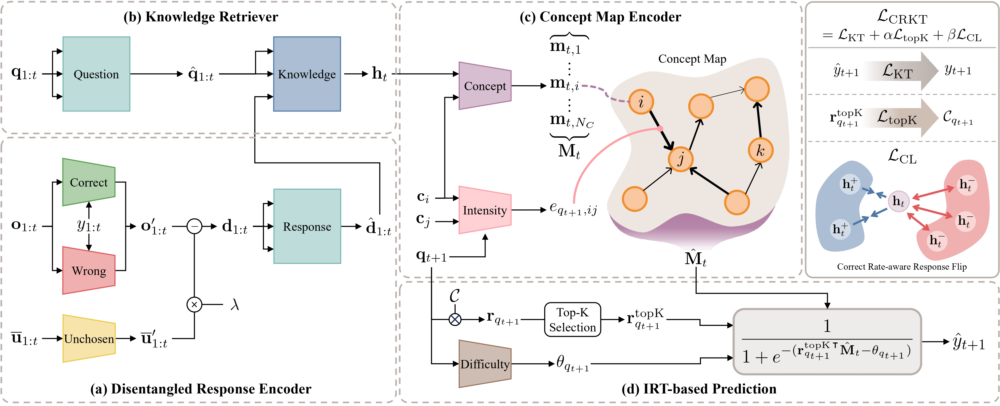

# CRKT

Welcome to the official implementation of the paper **"Enhancing Knowledge Tracing with Concept Map and Response Disentanglement"** published in *Knowledge-Based Systems* (2024).


## Paper Information

- **Authors:** Soonwook Park, Donghoon Lee, Hogun Park
- **Journal:** Knowledge-Based Systems
- **Year:** 2024
- **DOI:** [10.1016/j.knosys.2024.112346](https://doi.org/10.1016/j.knosys.2024.112346)
- **arXiv:** [2408.12996](https://arxiv.org/abs/2408.12996)


**Citation**

If you find our work useful, please consider citing it:

```bibtex
@article{park2024enhancing,
  title={Enhancing knowledge tracing with concept map and response disentanglement},
  author={Park, Soonwook and Lee, Donghoon and Park, Hogun},
  journal={Knowledge-Based Systems},
  pages={112346},
  year={2024},
  publisher={Elsevier}
}
```

## Model Architecture




## Experiment Environment
- python 3.10+
- torch 2.0+
- torch_geometric 2.4+
- scikit-learn 1.4+
- pandas 2.2.0+
- tqdm

**Environment Setting Example**

```bash
pip3 install torch torchvision torchaudio
pip3 install torch_geometric
pip3 install scikit-learn pandas tqdm
```


## Download Dataset

To use the CRKT model, you first need to download and prepare the necessary datasets. 

Follow the instructions below to download and set up datasets.


### 1. DBE-KT22 Dataset

1. Download the dataset files from [**here**](https://dataverse.ada.edu.au/dataset.xhtml?persistentId=doi:10.26193/6DZWOH).
2. Extract the downloaded files into the `data/DBE_KT22/raw` directory.
3. Additionally, extract the `2_DBE_KT22_datafiles_100102_csv.zip` file within the same directory to ensure all data files are available.
  
- **Required Files:**
  - `Questions.csv`
  - `Question_KC_Relationships.csv`
  - `KCs.csv`
  - `Question_Choices.csv`
  - `Transaction.csv`
  - `KC_Relationships.csv`


### 2. EdNet Dataset

1. Download the dataset file from [**here**](https://drive.google.com/file/d/1yLNUGvdWCY9tnX4L-MRfp2c2FYQWGKLm/view?usp=sharing).
2. Extract the downloaded file into the `data/EdNet/raw` directory.

- **Required File:**
  - `kt_ednet.json`


### 3. NIPS34 Dataset

1. Download the dataset files from [**here**](https://eedi.com/projects/neurips-education-challenge).
2. Extract the downloaded files into the `data/NIPS34/raw` directory.

- **Required Files:**
  - `data/metadata/question_metadata_task_3_4.csv`
  - `data/train_data/train_task_3_4.csv`
  - `data/metadata/subject_metadata.csv`


### 4. ENEM Dataset

1. Download the `enem_dep.zip` file from [**here**](https://github.com/godtn0/DP-MTL/blob/main/data/enem_data/enem_dep.zip).
2. Extract the downloaded file into the `data/ENEM/raw` directory.

- **Required File:**
  - `enem_dep.csv`

Make sure all the required files are properly extracted in the specified directory before proceeding with the model training or evaluation.


## Basic Usage


### Preprocessing Datasets

Before running experiments with the CRKT model, you must preprocess the datasets. Use the following command to preprocess the dataset:

```bash
python3 data_preprocess.py --dataset {dataset_name}
```

Replace {dataset_name} with the name of the folder containing the dataset you want to preprocess. This should match the folder name within the `data` directory.


### Run Experiment

To run an experiment with the CRKT model, use the following command:

```bash
python3 main.py --dataset {dataset_name} --model {model} --batch {batch_size} --lr {learning_rate} \
--dim_c {concept_dimension} --dim_q {question_dimension} --dim_g {gnn_output_dimension} \
--layer_g {gnn_layers} --lamb {lambda_value} --alpha {top_k_coefficient} --top_k {k_value} \
--beta {contrastive_loss_coefficient} --exp_name {experiment_name}
```

**Arguments:**
  - `--dataset {dataset_name}`: The name of the dataset folder located in the `data/` directory. Examples include `DBE_KT22`, `EdNet`, `NIPS34`, or `ENEM`.
  - `--model {model}`: The name of the model you want to use for the experiment.
  - `--batch {batch_size}`: The size of the batch used during training.
  - `--lr {learning_rate}`: The learning rate for the optimizer.
  - `--dim_c {concept_dimension}`: The dimension size for the concept embeddings.
  - `--dim_q {question_dimension}`: The dimension size for the question embeddings.
  - `--dim_g {gnn_output_dimension}`: The output dimension of the GNN (Graph Neural Network).
  - `--layer_g {gnn_layers}`: The number of layers in the GNN.
  - `--lamb {lambda_value}`: The lambda parameter used in the loss function.
  - `--top_k {k_value}`: The value of k for the top-k selection in the model.
  - `--alpha {top_k_coefficient}`: The coefficient for the top-k loss.
  - `--beta {contrastive_loss_coefficient}`: The coefficient for the contrastive learning loss.
  - `--exp_name {experiment_name}`: A name for the experiment, used for tracking and logging purposes.


**Example Command:**

To run an experiment with the DBE-KT22 dataset and the CRKT model with a batch size of 128, learning rate of 1e-3, and specified dimensions and coefficients, the command would look like:

```bash
python3 main.py --dataset DBE_KT22 --model CRKT --batch 128 --lr 1e-3 \
--dim_c 32 --dim_q 32 --dim_g 32 --layer_g 2 --lamb 0.1 --top_k 10 \
--alpha 0.1 --beta 0.01 --exp_name "test"
```
